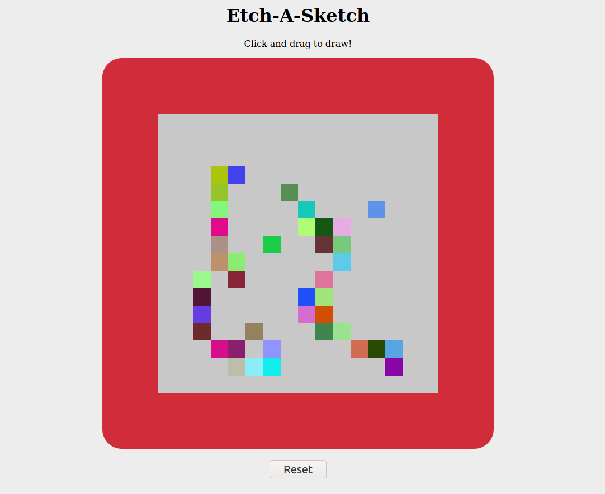

This is the Etch-A-Sketch Project for the Odin Project.

Click and drag to sketch a drawing in the sketch pad. The tile will be populated with a random color and will darken on each subsequent pass though.

Learned: 
Event bubbling 
More DOM manipulation 

Challenges: 
I spent a lot of time trying to directly manipulate the divs RGB color to make it darker before I realized that there was a CSS property for brightness.

Todo: 
Work on the UI 
Add a slider to change the grid size rather than a prompt 

